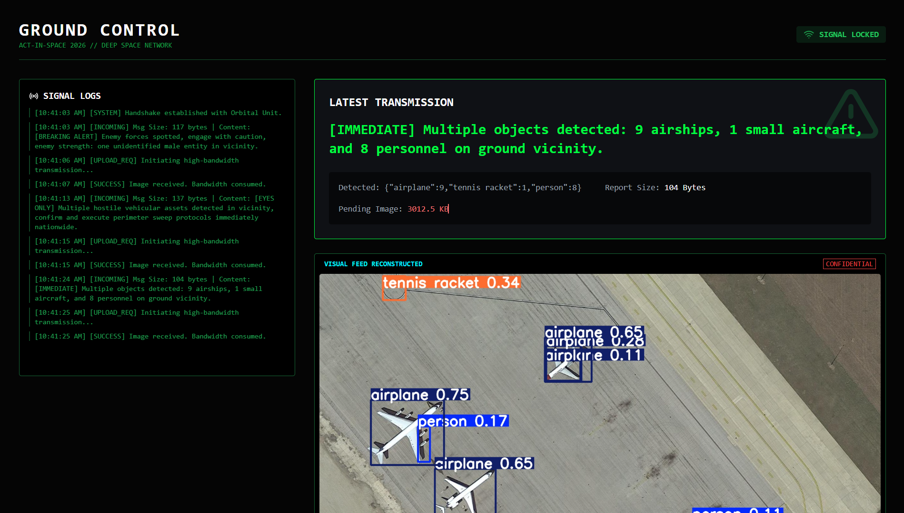

# 🛰️ The Gossiping Satellite - ActInSpace 2026

> **Challenge:** Space 4.0 & Data Compression
> **Team:** SpaceUS

## 🚀 The Problem
Satellite imagery is heavy (GBs). Transmitting raw data takes too much bandwidth, time, and energy.

## 💡 The Solution: Edge AI
Instead of sending images, our satellite **thinks** and **speaks**.
It processes images on-board using **YOLOv8** and generates a text-based intelligence report using **Llama-3 (Groq)**.

**Result:** 99.99% Bandwidth Savings.

## 🛠️ Tech Stack
- **On-board AI (Backend):** Python, FastAPI, YOLOv8, Groq API (Llama-3), WebSockets.
- **Ground Station (Frontend):** React, TailwindCSS, Vite.

## 📸 Demo


## 📦 Installation
### 1. Backend
```bash
cd backend
pip install -r requirements.txt
python server.py
```
### 2. Frontend
```bash
cd frontend
npm install
npm run dev
```
